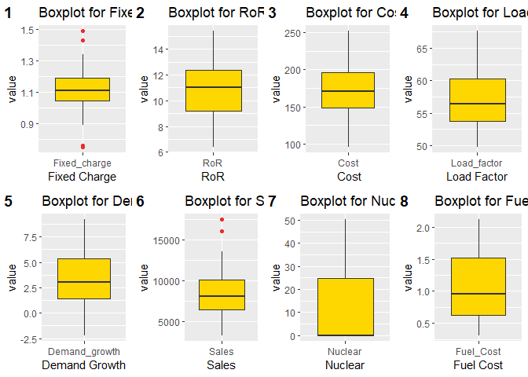
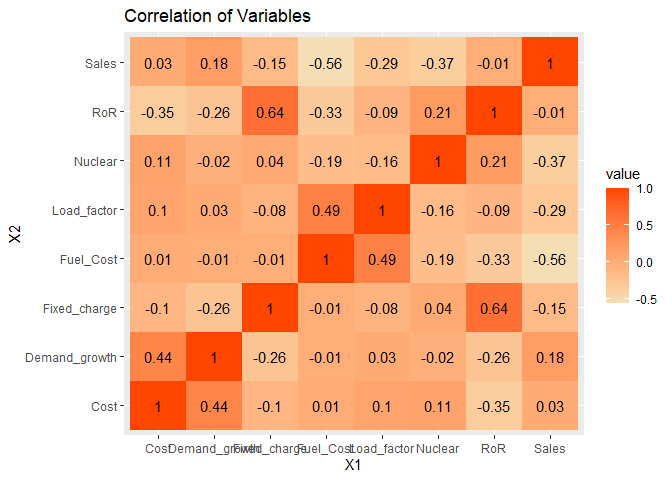

R Markdown
----------

This is an R Markdown document. Markdown is a simple formatting syntax
for authoring HTML, PDF, and MS Word documents. For more details on
using R Markdown see
<a href="http://rmarkdown.rstudio.com" class="uri">http://rmarkdown.rstudio.com</a>.

When you click the **Knit** button a document will be generated that
includes both content as well as the output of any embedded R code
chunks within the document. You can embed an R code chunk like this:
\#Load Packages

``` r
if(!require("pacman")) install.packages("pacman")
```

    ## Loading required package: pacman

``` r
pacman::p_load(forecast, tidyverse, gplots, GGally, mosaic,
               scales, mosaic, mapproj, mlbench, data.table,ggplot2, ggpubr)
```

\#Reading the Utilities File

``` r
getwd()
```

    ## [1] "C:/Users/chitr/OneDrive - The University of Texas at Dallas/Masters Collection/1st Sem/BA with R/HW1"

``` r
utilities <- read.csv("Utilities.csv")
str(utilities)
```

    ## 'data.frame':    22 obs. of  9 variables:
    ##  $ Company      : chr  "Arizona " "Boston " "Central " "Commonwealth" ...
    ##  $ Fixed_charge : num  1.06 0.89 1.43 1.02 1.49 1.32 1.22 1.1 1.34 1.12 ...
    ##  $ RoR          : num  9.2 10.3 15.4 11.2 8.8 13.5 12.2 9.2 13 12.4 ...
    ##  $ Cost         : int  151 202 113 168 192 111 175 245 168 197 ...
    ##  $ Load_factor  : num  54.4 57.9 53 56 51.2 60 67.6 57 60.4 53 ...
    ##  $ Demand_growth: num  1.6 2.2 3.4 0.3 1 -2.2 2.2 3.3 7.2 2.7 ...
    ##  $ Sales        : int  9077 5088 9212 6423 3300 11127 7642 13082 8406 6455 ...
    ##  $ Nuclear      : num  0 25.3 0 34.3 15.6 22.5 0 0 0 39.2 ...
    ##  $ Fuel_Cost    : num  0.628 1.555 1.058 0.7 2.044 ...

\#\#Creating DataTable

``` r
library(data.table)
Utilities_dt <- setDT(utilities)
```

\#\#Creating the summary

``` r
Utilities_dt[,sapply(.SD, summary), .SDcols=names(Utilities_dt)[-1]]
```

    ##         Fixed_charge      RoR     Cost Load_factor Demand_growth     Sales
    ## Min.        0.750000  6.40000  96.0000    49.80000     -2.200000  3300.000
    ## 1st Qu.     1.042500  9.20000 148.5000    53.77500      1.450000  6458.250
    ## Median      1.110000 11.05000 170.5000    56.35000      3.000000  8024.000
    ## Mean        1.114091 10.73636 168.1818    56.97727      3.240909  8914.045
    ## 3rd Qu.     1.190000 12.35000 195.7500    60.30000      5.350000 10128.250
    ## Max.        1.490000 15.40000 252.0000    67.60000      9.200000 17441.000
    ##         Nuclear Fuel_Cost
    ## Min.        0.0  0.309000
    ## 1st Qu.     0.0  0.630000
    ## Median      0.0  0.960000
    ## Mean       12.0  1.102727
    ## 3rd Qu.    24.6  1.516250
    ## Max.       50.2  2.116000

\#\#Calculating the standard Deviation

``` r
Utilities_dt[,sapply(.SD, sd), .SDcols=names(Utilities_dt)[-1]]
```

    ##  Fixed_charge           RoR          Cost   Load_factor Demand_growth 
    ##     0.1845112     2.2440494    41.1913495     4.4611478     3.1182503 
    ##         Sales       Nuclear     Fuel_Cost 
    ##  3549.9840305    16.7919198     0.5560981

\#\#\#Difference in Median and mean of percent nuclear are large so the
distribution will be skewed.We are getting few outliers in Fixed_charge
and Sales as we can see from mean and quartile range when compared with
min and max values of the variables.Sales is comparatively larger in
terms of variability over other variables since the standard deviation
of sales is the largest \#\# Including Plots

``` r
Melted_FixedCharge <- melt(data = Utilities_dt, id.vars ="Company", measure.vars ="Fixed_charge")

Melted_RoR <- melt(data = Utilities_dt, id.vars ="Company", measure.vars ="RoR")
Melted_Cost <- melt(data = Utilities_dt, id.vars ="Company", measure.vars ="Cost")

Melted_LoadFactor <- melt(data = Utilities_dt, id.vars ="Company", measure.vars ="Load_factor")

Melted_DemandGrowth <- melt(data = Utilities_dt, id.vars ="Company", measure.vars ="Demand_growth")

Melted_Sales <- melt(data = Utilities_dt, id.vars ="Company", measure.vars ="Sales")

Melted_Nuclear <- melt(data = Utilities_dt, id.vars ="Company", measure.vars ="Nuclear")

Melted_FuelCost <- melt(data = Utilities_dt, id.vars ="Company", measure.vars ="Fuel_Cost")

BPFCharge <- ggplot(Melted_FixedCharge) +
  geom_boxplot(aes(x = variable, y = value), 
               fill = "gold1", outlier.color = "firebrick2") + 
  xlab("Fixed Charge") + ggtitle("Boxplot for Fixed Charge")

BPRoR <- ggplot(Melted_RoR) +
  geom_boxplot(aes(x = variable, y = value), 
               fill = "gold1", outlier.color = "firebrick2") + 
  xlab("RoR") + ggtitle("Boxplot for RoR")

BPMC <- ggplot(Melted_Cost) +
  geom_boxplot(aes(x = variable, y = value), 
               fill = "gold1", outlier.color = "firebrick2") + 
  xlab(" Cost") + ggtitle("Boxplot for Cost")

BPLF <- ggplot(Melted_LoadFactor) +
  geom_boxplot(aes(x = variable, y = value), 
               fill = "gold1", outlier.color = "firebrick2") + 
  xlab("Load Factor") + ggtitle("Boxplot for Load Factor")

BPDG <- ggplot(Melted_DemandGrowth) +
  geom_boxplot(aes(x = variable, y = value), 
               fill = "gold1", outlier.color = "firebrick2") + 
  xlab("Demand Growth") + ggtitle("Boxplot for Demand Growth")

BPMS <- ggplot(Melted_Sales) +
  geom_boxplot(aes(x = variable, y = value), 
               fill = "gold1", outlier.color = "firebrick2") + 
  xlab("Sales") + ggtitle("Boxplot for Sales")

BPMN <- ggplot(Melted_Nuclear) +
  geom_boxplot(aes(x = variable, y = value), 
               fill = "gold1", outlier.color = "firebrick2") + 
  xlab("Nuclear") + ggtitle("Boxplot for Nuclear")

BPFCost <- ggplot(Melted_FuelCost) +
  geom_boxplot(aes(x = variable, y = value), 
               fill = "gold1", outlier.color = "firebrick2") + 
  xlab("Fuel Cost") + ggtitle("Boxplot for Fuel Cost")

layout <- ggarrange(BPFCharge, BPRoR, BPMC, BPLF, BPDG, BPMS, BPMN, BPFCost, 
                    labels = c("1", "2", "3", "4", "5", "6", "7", "8"), ncol = 4, nrow = 2) 
layout  
```



\#\#\#Are there any extreme values for any of the variables ?Which
ones?Explain your answers. \#\#\#There are two variables which are
having extreme values or outliers as shown in the box plot.Fixed Charge
and Sales.For fixed charge the range will be roughly from 0.96 to 1.26
,there are 3 values less than 0.96 (i.e. Boston,Nevada,San Diego) and 4
variables above 1.26 range (i.e. Central,NY,Florida,Kentucky). \#\#\#For
Sales there is 1 value less than lower limit (i.e. NY) and 4 values
above the upper limit (i.e. Texas,Puget,Nevada,Idaho) \#\#Heat Map

``` r
library(reshape)
```

    ## 
    ## Attaching package: 'reshape'

    ## The following object is masked from 'package:data.table':
    ## 
    ##     melt

    ## The following object is masked from 'package:Matrix':
    ## 
    ##     expand

    ## The following object is masked from 'package:dplyr':
    ## 
    ##     rename

    ## The following objects are masked from 'package:tidyr':
    ## 
    ##     expand, smiths

``` r
utility.cor.mat <- round(cor(Utilities_dt[,!c("Company")]),2)  
melted.utility.cor.mat <- melt(utility.cor.mat) 

ggplot(melted.utility.cor.mat, aes(x = X1, y = X2, fill = value)) + 
  scale_fill_gradient(low="wheat", high="orangered") +
  geom_tile() + 
  geom_text(aes(x = X1, y = X2, label = value)) +
  ggtitle("Correlation of Variables")
```


\#\#\#There is positive relationship between (demand_growth and
cost),(load factor and fuel cost).There is strong positive relationship
between ROR and fixed charge.There is strong negative relationship
between Sales and Fuel Cost.Inverse relationship btw demand growth and
fixed charge shows as more people use utility ,the fixed cost goes
down.Positive relationship btw fuel cost and load factor shows that for
better utility efficiency, the cost of fuel will be higher. \#\#\#PCA

``` r
Utilities.df <- setDF(Utilities_dt)
pcs8 <- prcomp(na.omit(Utilities.df[,-c(1)])) 
summary(pcs8)
```

    ## Importance of components:
    ##                              PC1      PC2      PC3   PC4   PC5   PC6    PC7
    ## Standard deviation     3549.9901 41.26913 15.49215 4.001 2.783 1.977 0.3501
    ## Proportion of Variance    0.9998  0.00014  0.00002 0.000 0.000 0.000 0.0000
    ## Cumulative Proportion     0.9998  0.99998  1.00000 1.000 1.000 1.000 1.0000
    ##                           PC8
    ## Standard deviation     0.1224
    ## Proportion of Variance 0.0000
    ## Cumulative Proportion  1.0000

``` r
pcs8$rot
```

    ##                         PC1           PC2           PC3           PC4
    ## Fixed_charge   7.883140e-06 -0.0004460932  0.0001146357 -0.0057978329
    ## RoR            6.081397e-06 -0.0186257078  0.0412535878  0.0292444838
    ## Cost          -3.247724e-04  0.9974928360 -0.0566502956 -0.0179103135
    ## Load_factor    3.618357e-04  0.0111104272 -0.0964680806  0.9930009368
    ## Demand_growth -1.549616e-04  0.0326730808 -0.0038575008  0.0544730799
    ## Sales         -9.999983e-01 -0.0002209801  0.0017377455  0.0005270008
    ## Nuclear        1.767632e-03  0.0589056695  0.9927317841  0.0949073699
    ## Fuel_Cost      8.780470e-05  0.0001659524 -0.0157634569  0.0276496391
    ##                         PC5           PC6           PC7           PC8
    ## Fixed_charge   0.0198566131 -0.0583722527 -1.002990e-01  9.930280e-01
    ## RoR            0.2028309717 -0.9735822744 -5.984233e-02 -6.717166e-02
    ## Cost           0.0355836487 -0.0144563569 -9.986723e-04 -1.312104e-03
    ## Load_factor    0.0495177973  0.0333700701  2.930752e-02  9.745357e-03
    ## Demand_growth -0.9768581322 -0.2038187556  8.898790e-03  8.784363e-03
    ## Sales          0.0001471164  0.0001237088 -9.721241e-05  5.226863e-06
    ## Nuclear       -0.0057261758  0.0430954352 -1.043775e-02  2.059461e-03
    ## Fuel_Cost     -0.0215054038  0.0633116915 -9.926283e-01 -9.594372e-02

\#\#\#From standard PCAs analysis,we get to know that PC1 and PC2 can
give us the values required for correct analysis of the data. So,We can
drop rest of the variables as we have already reached 99% of the
cumulative proportion.We are just considering one variable for dimension
reduction analysis

\#\#\#\#Normalised PCAs

``` r
pcs.cor <- prcomp(na.omit(Utilities.df[,-c(1)]), scale. = T)
summary(pcs.cor)
```

    ## Importance of components:
    ##                           PC1    PC2    PC3    PC4     PC5     PC6     PC7
    ## Standard deviation     1.4741 1.3785 1.1504 0.9984 0.80562 0.75608 0.46530
    ## Proportion of Variance 0.2716 0.2375 0.1654 0.1246 0.08113 0.07146 0.02706
    ## Cumulative Proportion  0.2716 0.5091 0.6746 0.7992 0.88031 0.95176 0.97883
    ##                            PC8
    ## Standard deviation     0.41157
    ## Proportion of Variance 0.02117
    ## Cumulative Proportion  1.00000

``` r
pcs.cor$rot
```

    ##                       PC1         PC2         PC3         PC4        PC5
    ## Fixed_charge   0.44554526 -0.23217669  0.06712849 -0.55549758  0.4008403
    ## RoR            0.57119021 -0.10053490  0.07123367 -0.33209594 -0.3359424
    ## Cost          -0.34869054  0.16130192  0.46733094 -0.40908380  0.2685680
    ## Load_factor   -0.28890116 -0.40918419 -0.14259793 -0.33373941 -0.6800711
    ## Demand_growth -0.35536100  0.28293270  0.28146360 -0.39139699 -0.1626375
    ## Sales          0.05383343  0.60309487 -0.33199086 -0.19086550 -0.1319721
    ## Nuclear        0.16797023 -0.08536118  0.73768406  0.33348714 -0.2496462
    ## Fuel_Cost     -0.33584032 -0.53988503 -0.13442354 -0.03960132  0.2926660
    ##                       PC6         PC7         PC8
    ## Fixed_charge  -0.00654016  0.20578234 -0.48107955
    ## RoR           -0.13326000 -0.15026737  0.62855128
    ## Cost           0.53750238 -0.11762875  0.30294347
    ## Load_factor    0.29890373  0.06429342 -0.24781930
    ## Demand_growth -0.71916993 -0.05155339 -0.12223012
    ## Sales          0.14953365  0.66050223  0.10339649
    ## Nuclear        0.02644086  0.48879175 -0.08466572
    ## Fuel_Cost     -0.25235278  0.48914707  0.43300956

\#\#\#From Normalised PCAs,since all variables are considered for the
dimension reduction analysis so the changes in cumultive proprtion is
gradually increasing.In this we need to consider PC1 to PC7 for better
results.
